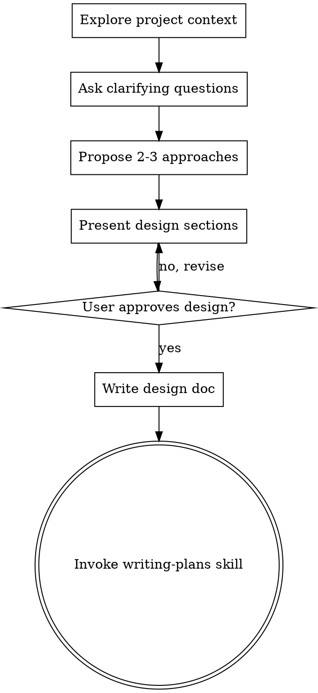

> **改编自 [obra/superpowers](https://github.com/obra/superpowers/blob/main/skills/brainstorming/SKILL.md)** — 核心流程和 HARD-GATE 概念。本版本增加了 Visual Companion（A/B 架构决策图）和用于审计集成的 spec-review-checklist。

# 头脑风暴：从想法到设计

## 概述

通过自然的协作对话，将想法转化为完整的设计和规范。

首先了解当前项目背景，然后逐个提问来完善想法。在理解要构建的内容后，呈现设计方案并获得用户批准。

<HARD-GATE>
在呈现设计方案并获得用户批准之前，**不要**调用任何实现技能、编写任何代码、搭建任何项目，或采取任何实现行动。这适用于所有项目，无论感知上多么简单。
</HARD-GATE>

## 反模式："这太简单了，不需要设计"

每个项目都要经过这个流程。待办事项列表、单一功能工具、配置变更——都是如此。"简单"项目正是未经审视的假设导致最多浪费工作的地方。设计可以很短（真正简单的项目几句话即可），但你**必须**呈现它并获得批准。

## 检查清单

你**必须**为以下每个项目创建任务并按顺序完成：

1. **探索项目背景** — 检查文件、文档、最近的提交
2. **提出澄清问题** — 逐个提问，理解目的/约束/成功标准
3. **提出 2-3 个方案** — 包含权衡和你的建议
   - **[视觉检查]** 方案涉及架构/数据流/UI/多组件？→ 生成 A/B 对比可视化（见下方 Visual Companion 段）并 `open` 给用户看
4. **呈现设计** — 按复杂度分节呈现，每节后获得用户批准
   - **[视觉检查]** 设计涉及组件关系/状态流转/数据管道？→ 生成架构图/流程图并 `open` 给用户看
5. **运行规范审查** — 内部验证完整性和一致性，自动生成 Review Checklist（见规范审查段）
6. **编写设计文档** — 保存到 Obsidian `01-项目开发/02-项目设计/{项目名}/YYYY-MM-DD-<topic>-design.md`，包含 Review Checklist 段落
7. **过渡到实现** — 调用 writing-plans 技能创建实施计划

## 流程图



**终止状态是调用 writing-plans。** 不要调用 frontend-design、mcp-builder 或任何其他实现技能。头脑风暴之后唯一调用的技能是 writing-plans。

## 流程详解

**理解想法：**
- 首先查看当前项目状态（文件、文档、最近的提交）
- 逐个提问来完善想法
- 尽可能用多选题，开放式问题也可以
- 每条消息只问一个问题 — 如果某个主题需要更多探索，拆分为多个问题
- 聚焦于理解：目的、约束、成功标准

**探索方案：**
- 提出 2-3 个不同方案及其权衡
- 对话式呈现选项，说明你的建议和理由
- 先说明推荐方案并解释原因

**呈现设计：**
- 一旦你认为理解了要构建的内容，就开始呈现设计
- 根据每节的复杂度调整篇幅：简单则几句话，复杂则 200-300 字
- 每节后询问是否看起来正确
- 覆盖：架构、组件、数据流、错误处理、测试
- 如果有不明白的地方，准备好回去澄清

## 设计之后

**文档：**
- 将经验证的设计写入 `docs/plans/YYYY-MM-DD-<topic>-design.md`
- 如有 elements-of-style:writing-clearly-and-concisely 技能可用，使用它
- 将设计文档提交到 git

**实现：**
- 调用 writing-plans 技能创建详细的实施计划
- 不要调用任何其他技能。writing-plans 是下一步。

## Visual Companion（检查清单步骤 3/4 自动判断）

**已嵌入检查清单的 [Visual Check] 节点。** 走到步骤 3 或步骤 4 时，自动判断：

> "Would the user understand this better by seeing it than reading it?"

**YES 的场景（必须生成）**：
- 2+ 组件/服务的交互关系 → 架构图（Mermaid）
- A/B 方案各有 3+ 条 pros/cons → 对比可视化
- 数据经过 3+ 步变换 → 数据流图
- UI 布局讨论 → 线框图 mockup

**NO 的场景（跳过）**：
- 单文件配置变更
- 单函数修改
- 纯逻辑讨论（没有空间/结构维度）

生成后用 `open /tmp/brainstorm-visuals/<timestamp>-<topic>.html` 直接在浏览器打开。
HTML 模板见 `visual-companion.md`。

---

## 规范审查与检查清单生成

在步骤 4（设计批准）之后、步骤 5（编写设计文档）之前：

1. 内部运行规范审查检查清单（`spec-review-checklist.md`）
2. 仅当发现真正的阻碍时，才向用户提出
3. **自动生成 Review Checklist** 并追加到设计文档

Review Checklist 会贯穿到 PUA 阶段 3+4 的代码审查 — 审查者根据这些检查清单项验证实现。这确保头脑风暴的决策被跟踪到完成。

```markdown
## Review Checklist (auto-generated)
- [ ] {component}: {responsibility} — implemented as specified
- [ ] Data flow: {source} → {destination} — matches spec
- [ ] Error handling: {strategy} — implemented
- [ ] Quality gate: {measurable_criterion}
- [ ] Edge case: {case} — handled
```

---

## 关键原则

- **一次一问** — 不要用多个问题淹没用户
- **首选多选** — 可能时比开放式问题更容易回答
- **YAGNI 原则** — 从所有设计中删除不必要的功能
- **探索替代方案** — 在确定之前始终提出 2-3 个方案
- **增量验证** — 呈现设计，获得批准后再继续
- **保持灵活** — 当有不合理的地方，回去澄清
